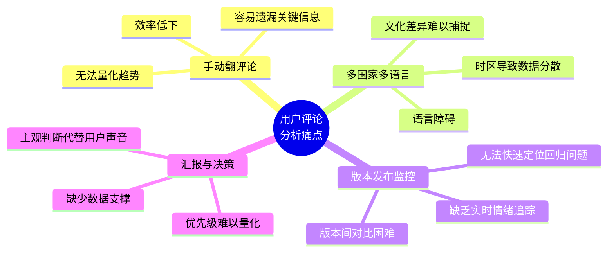
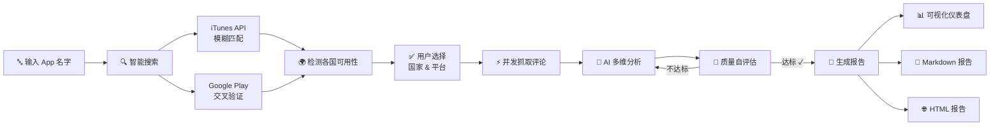
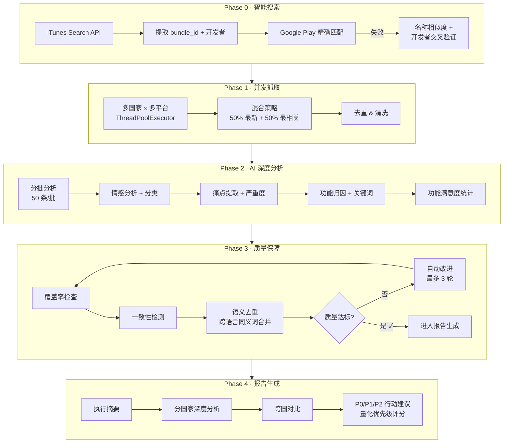
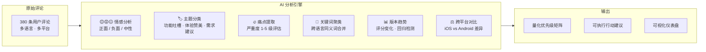
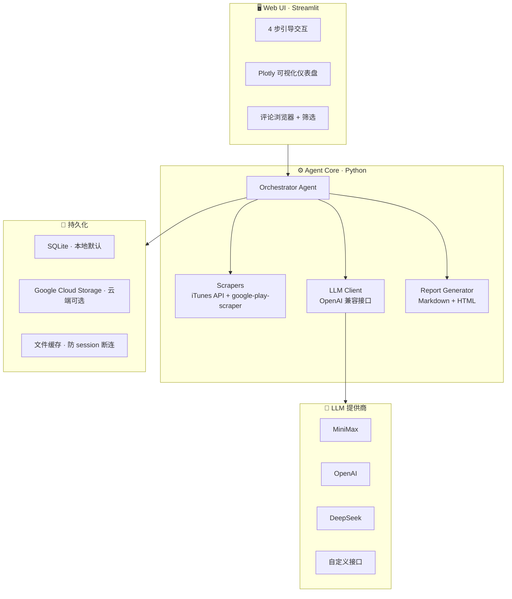
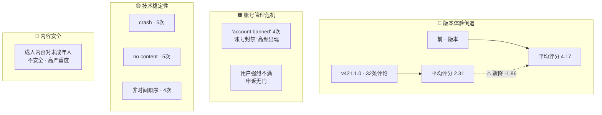
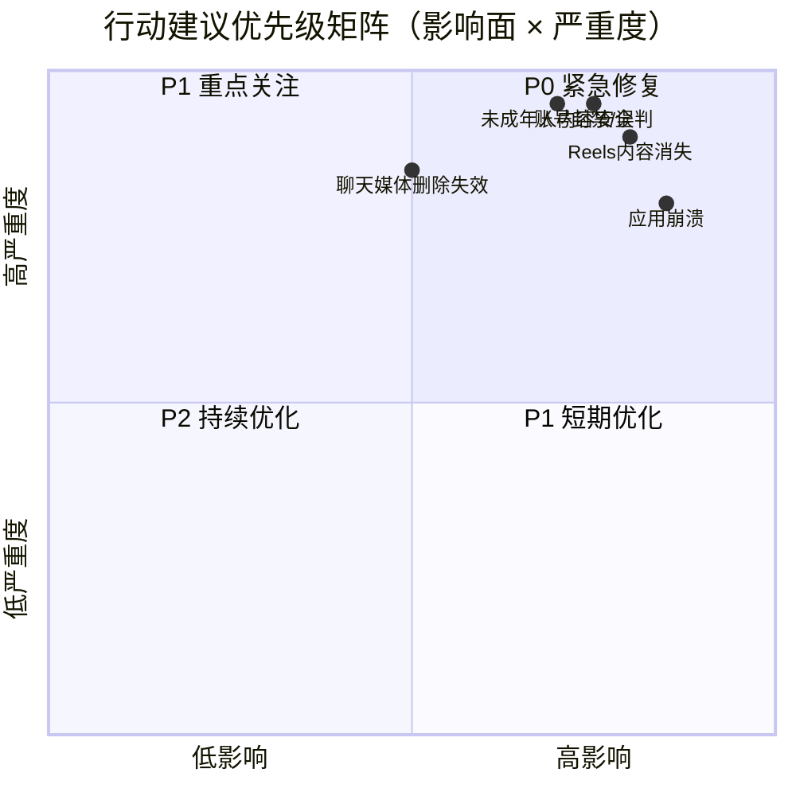

<p align="center">
  <h1 align="center">AppPulse</h1>
  <p align="center"><strong>感知每一条用户心声</strong></p>
  <p align="center">
    输入 App 名字 → 自动抓取全球评论 → AI 深度分析 → 专业洞察报告
  </p>
  <p align="center">
    <a href="#快速开始">快速开始</a> · <a href="#核心亮点">核心亮点</a> · <a href="#示例报告instagram-评论洞察">示例报告</a> · <a href="#部署">部署</a>
  </p>
</p>

---

## 为什么需要 AppPulse？



AppPulse 把这些事情自动化了：**一个名字进去，一份专业报告出来**。

---

## 核心亮点

| 亮点 | 说明 |
|------|------|
| 🌍 双平台全球覆盖 | App Store + Google Play，10+ 国家/地区并发抓取 |
| 🔍 智能搜索匹配 | 输入"ins"也能找到 Instagram，跨平台交叉验证防止错误关联 |
| 🧠 多维度 AI 分析 | 情感分析、痛点提取、功能归因、关键词去重、评分一致性检测 |
| 🔄 自我质量评估 | Agent 自动评估分析质量，不达标则自动改进（最多 3 轮） |
| 📊 量化行动建议 | P0/P1/P2 三级优先级，每条建议带 影响面 × 严重度 × 可解决性 评分 |
| 📈 可视化仪表盘 | 6 种图表 + 评论浏览器 + 多国家 Tab 切换 |
| 📥 多格式导出 | Markdown / HTML / CSV 一键下载 |
| 🔌 灵活 LLM 接入 | 支持 MiniMax、OpenAI、DeepSeek 等任何 OpenAI 兼容接口 |

---

## 产品业务流



---

## Agent 工作流程



---

## AI 分析维度



---

## 技术架构



---

## 快速开始

### 1. 安装

```bash
git clone https://github.com/TF-Wilbur/AppPulse.git
cd AppPulse
pip install -e ".[web,dev]"
```

### 2. 配置

```bash
cp .env.example .env
# 编辑 .env，填入你的 LLM API Key
```

| 变量 | 说明 | 默认值 |
|------|------|--------|
| `LLM_API_KEY` | LLM API 密钥 | — |
| `LLM_BASE_URL` | OpenAI 兼容接口地址 | `https://api.minimax.chat/v1` |
| `LLM_MODEL` | 模型名称 | `MiniMax-M2.7` |

### 3. 启动 Web UI（推荐）

```bash
streamlit run web/app.py
```

浏览器打开 `http://localhost:8501`，按引导操作即可。

### 4. 命令行使用

```bash
# 基础用法
apppulse "TikTok"

# 多国家 + 指定平台
apppulse "微信" --countries us,cn,jp --platforms app_store,google_play --count 200
```

| 参数 | 说明 | 默认值 |
|------|------|--------|
| `app_name` | App 名字 | — |
| `--count` | 每平台每国家评论数 | 100 |
| `--countries` | 国家代码，逗号分隔 | `us` |
| `--platforms` | 平台，逗号分隔 | `app_store,google_play` |
| `--output` | 报告输出目录 | `reports` |

---

## 部署

### Docker

```bash
docker build -t apppulse .
docker run -p 8080:8080 --env-file .env apppulse
```

### Google Cloud Run

```bash
gcloud run deploy apppulse \
  --source . \
  --region asia-east1 \
  --allow-unauthenticated \
  --timeout 600 \
  --set-env-vars "LLM_API_KEY=your-key,LLM_BASE_URL=https://api.minimax.chat/v1,LLM_MODEL=MiniMax-M2.7"
```

---

## 项目结构

```
AppPulse/
├── review_radar/
│   ├── agent.py          # Agent 主循环（Orchestrator 模式）
│   ├── tool_impl.py      # Tool 实现（抓取、分析、评估、报告）
│   ├── scrapers.py       # App Store + Google Play 抓取 + 搜索验证
│   ├── prompts.py        # 所有 Prompt 模板
│   ├── llm.py            # LLM 客户端封装
│   ├── providers.py      # 多 LLM 提供商支持
│   ├── models.py         # 数据模型
│   ├── availability.py   # 国家可用性检测
│   ├── history.py        # 分析历史（SQLite / GCS 双后端）
│   ├── config.py         # 配置常量
│   ├── report.py         # 报告保存 + HTML 导出
│   └── cli.py            # CLI 入口 + Rich 终端 UI
├── web/
│   └── app.py            # Streamlit Web UI
├── examples/             # 示例报告
├── tests/                # 测试
├── .streamlit/           # Streamlit 配置
├── Dockerfile
├── pyproject.toml
└── .env.example
```

---

## 示例报告：Instagram 评论洞察

> 以下是 AppPulse 对 Instagram 的真实分析报告（380 条评论），展示完整的输出效果。

### 📊 数据概览

| 指标 | 数值 |
|------|------|
| 总评论数 | 380 条 |
| 正面 / 负面 / 中性 | 54% / 46% / 16% |
| 功能吐槽类评论 | 46% |
| 需求建议类评论 | 7% |
| 高严重度痛点 | 10 个 |

### 核心发现



### 🇺🇸 美国市场 · 跨平台对比

```mermaid
---
config:
  xyChart:
    width: 600
    height: 300
---
xychart-beta
    title "iOS vs Android 情感分布"
    x-axis ["负面情感", "正面情感", "中性情感"]
    y-axis "占比 (%)" 0 --> 80
    bar [75, 17, 8]
    bar [35, 65, 0]
```



| 维度 | iOS | Android |
|:-----|:----|:--------|
| 评论数 | 48 条 | ~20 条（样本） |
| 负面情感占比 | **75%** | ~30-40% |
| 正面情感占比 | 17% | ~60-70% |
| 核心痛点 | 账号安全、技术稳定性 | 功能缺失、技术故障 |

> iOS 用户负面情绪（75%）远超 Android 用户，且反馈包含更多技术细节；Android 用户更倾向于快速表态。

### iOS 高频痛点 TOP 10

| 排名 | 痛点描述 | 严重性 |
|:----:|:---------|:------:|
| 1 | 更新后语音特效功能缺失 | 🔴 高 |
| 2 | 算法频繁变化导致用户增长困难，频繁被 shadowban | 🔴 高 |
| 3 | 删除故事时收不到验证码 | 🔴 高 |
| 4 | 通话功能权限设置异常 | 🔴 高 |
| 5 | 账号被恶意举报后无限期封禁 | 🔴 高 |
| 6 | 广告过多，feed 被广告淹没 | 🔴 高 |
| 7 | 应用影响心理健康 | 🔴 高 |
| 8 | AI 审核系统误判，账号被错误封禁 | 🔴 高 |
| 9 | 账号无故被删除，申诉无门 | 🔴 高 |
| 10 | 应用存在随机播放音乐 bug | 🔴 高 |

### iOS 评分分布

| 星级 | 数量 | 占比 | 分布 |
|:----:|:----:|:----:|:-----|
| ★★★★★ | 13 | 27% | `████████░░░░░░░░░░░░` |
| ★★★★☆ | 7 | 15% | `████░░░░░░░░░░░░░░░░` |
| ★★★☆☆ | 6 | 13% | `███░░░░░░░░░░░░░░░░░` |
| ★★☆☆☆ | 5 | 10% | `███░░░░░░░░░░░░░░░░░` |
| ★☆☆☆☆ | 17 | 35% | `██████████░░░░░░░░░░` |

> 典型"两极分化"：低分（★1-2）合计 45%，高分（★4-5）合计 42%。

### 行动建议优先级矩阵



### P0 紧急修复（1–2 周）

**1. 账号被反复暂停/封禁**

| 维度 | 评分 | 说明 |
|------|:----:|------|
| 影响面 | 3 | 封禁直接影响账号全量功能 |
| 严重程度 | 5 | 用户完全无法使用，信任损伤严重 |
| 可解决性 | 3 | 申诉流程自动化改造需后端配合 |

具体动作：
- 上线"封禁原因分级展示"功能，向用户明确说明违规类型和剩余等待时间
- 增设 AI 预审通道，在封禁转永久前自动触发机器学习复核

**2. 应用频繁崩溃/技术故障长期未修复**

| 维度 | 评分 | 说明 |
|------|:----:|------|
| 影响面 | 4 | crash 是负面关键词中频率最高的技术词 |
| 严重程度 | 4 | 崩溃直接导致内容发布中断 |
| 可解决性 | 4 | Crash 堆栈已有监控，可针对性修复 |

具体动作：
- 定位前 3 个高频崩溃场景（Reels 播放页、Stories 发布页、DM 媒体加载页）
- 14 天内发布补丁版本

### P1 短期优化（1–3 个月）

**3. Reels 内容消失且客服无响应** — 审计内容审核误删率，目标误删率降至 <1%

**4. 聊天媒体删除功能不可用** — UI 按钮逻辑修复

**5. 成人内容暴露/未成年人安全隐患** — 在未成年用户 feed 中强制开启"内容安全模式"

---

### 分析说明

| 项目 | 说明 |
|------|------|
| 数据来源 | iOS App Store / Android Google Play |
| 总评论数 | 380 条 |
| 分析市场 | 🇺🇸 美国 |
| 分析方法 | 情感分析 + 痛点提取 + 关键词统计 + 版本趋势 |

---

## License

MIT
